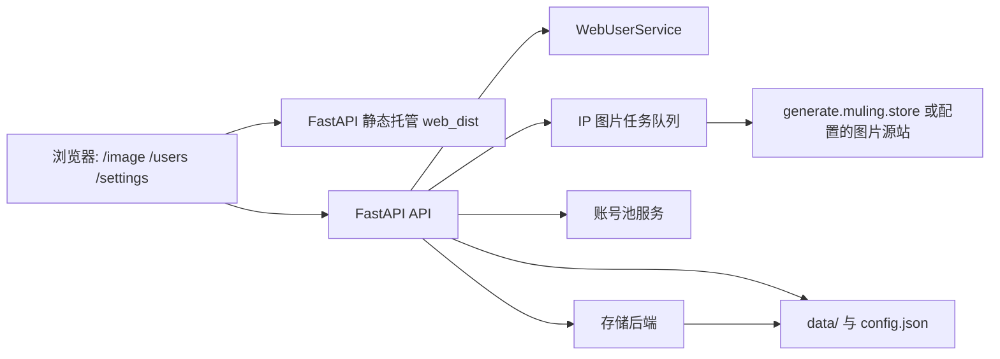
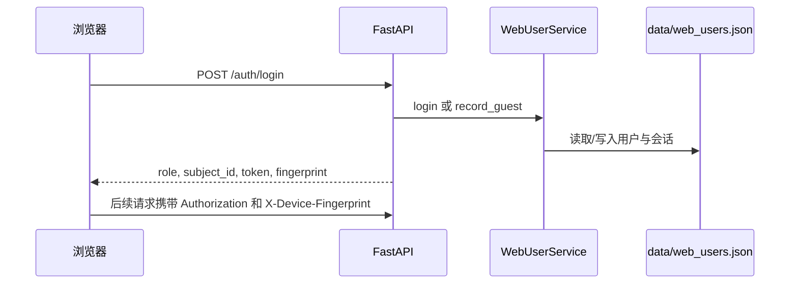

# 系统架构

## 总体结构

项目运行时只有一个主要 Web 服务进程。FastAPI 同时负责：

- 提供 API。
- 启动后台账号刷新线程。
- 启动 IP 图片任务调度线程。
- 托管 `web_dist` 静态前端。
- 挂载 `data/images` 为 `/images` 静态资源。

## 后端模块

| 模块 | 职责 |
| --- | --- |
| `api/app.py` | 创建 FastAPI 应用、图片代理、IP 限额图片任务、分享奖励、静态前端托管。 |
| `api/system.py` | 登录、版本、设置、图片管理、日志、用户管理、默认额度。 |
| `api/ai.py` | OpenAI 兼容接口路由。 |
| `api/accounts.py` | API Key、账号池、CPA、Sub2API 管理。 |
| `api/image_tasks.py` | 兼容鉴权后的图片任务接口。 |
| `api/register.py` | 自动注册任务配置和事件流。 |
| `services/web_user_service.py` | 用户、访客、管理员、会话、角色、额度套餐。 |
| `services/config.py` | 配置读取、运行目录、版本、图片清理、存储后端创建。 |
| `services/image_task_service.py` | 普通图片任务持久化和后台执行。 |
| `services/storage/` | JSON、SQLite/Postgres、Git 存储后端。 |
| `services/protocol/` | OpenAI/Anthropic 风格协议适配。 |

## 前端模块

| 模块 | 职责 |
| --- | --- |
| `web/src/app/image/page.tsx` | 图片工作台主页面，包含桌面端和手机端布局。 |
| `web/src/app/users/page.tsx` | 用户管理页面，支持筛选、排序、额度、套餐、删除。 |
| `web/src/lib/api.ts` | 前端 API 类型和请求函数。 |
| `web/src/lib/request.ts` | API Base URL 解析和通用请求封装。 |
| `web/src/store/auth.ts` | 登录态、Token、角色和本地兼容迁移。 |
| `web/src/store/image-conversations.ts` | 本地图片对话历史。 |

## 图片任务队列

IP 限额图片任务由 `api/app.py` 内部维护：

- `IP_IMAGE_TASK_MAX_WORKERS` 控制全局工作线程数量，默认 `80`。
- `MAX_OWNER_QUEUED_IMAGE_TASKS` 控制单个 owner 排队上限，默认 `4`。
- 任务写入 `data/ip_image_tasks.json`。
- 服务启动时会恢复任务文件，未完成任务由调度器继续处理或标记。
- 成功任务的数据会参与用户管理里的使用额度统计。

## 图片代理与缓存

图片源站默认为 `IMAGE_PROXY_BASE_URL=https://generate.muling.store`。服务会：

- 请求 `/v1/images/generations` 或 `/v1/images/edits`。
- 对返回的图片 URL 做持久化和代理。
- 将代理缓存放到 `data/images/proxy-cache`。
- 使用 Pillow 验证内容确实是有效图片。
- 静态路径通过 `/images/...` 对外访问。

## 鉴权链路

管理员登录使用短会话 Token，普通用户登录以设备指纹绑定会话。未登录访问会记录为访客。

