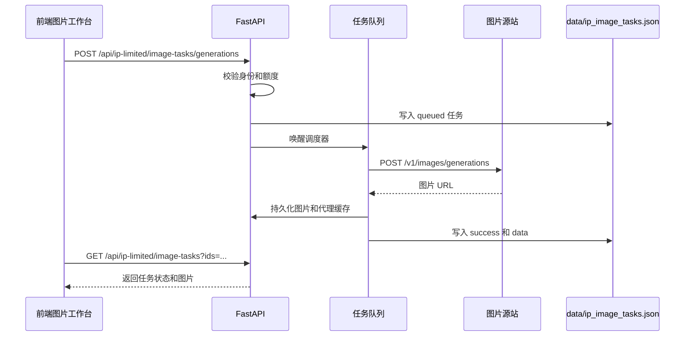

# 图片工作流

## 图片生成流程



## 图片编辑流程

图片编辑支持多参考图：

- 前端最多加载 4 张图到上传区域。
- 后端通过 `IMAGE_PROXY_EDIT_MAX_UPLOADS` 限制上传数量，默认 4。
- 上传图片会被压缩或限制尺寸，默认最大边 `2048`。
- 单张上传最大字节数由 `IMAGE_PROXY_EDIT_MAX_UPLOAD_BYTES` 控制，默认 12 MB。

图片编辑任务接口：

```http
POST /api/ip-limited/image-tasks/edits
Content-Type: multipart/form-data
```

字段：

- `image`：一张或多张参考图。
- `client_task_id`：前端生成的任务 ID。
- `prompt`：编辑提示词。
- `model`：默认 `gpt-image-2`。
- `size`：可选。

## 继续编辑生成结果

生成结果区域提供“编辑图片”按钮。点击后：

1. 前端读取当前生成结果图片。
2. 如果图片来自远程 URL，会优先通过本服务代理读取。
3. 图片转换为 `File` 对象。
4. 加载到编辑上传区域。
5. 自动切换为编辑模式。

为了提升速度，前端有参考图构建缓存，后端有代理图片缓存。这样重复点击同一张图不会每次都重新拉取远程图片。

## 额度消耗与退回

生成或编辑前会先扣额度：

```text
_consume_ip_quota(quota_key, limit, count)
```

以下情况会退回额度：

- 提示词安全检查失败。
- 源站返回错误。
- 返回图片数量少于请求数量。
- 图片完成但无法持久化或无法确认有效。

任务方式下，成功任务会参与用户管理的使用额度统计。

## 图片代理缓存

图片代理用于解决远程图片加载失败、跨域和二次编辑慢的问题。

关键点：

- 允许代理的 URL 必须属于配置的图片源站或已允许范围。
- 缓存目录为 `data/images/proxy-cache`。
- 缓存 key 使用 URL 摘要。
- 缓存内容会保存图片文件和 content-type。
- 读取时会校验图片内容，避免 HTML 错误页被当成图片。

## 图片历史

前端图片历史保存在浏览器本地存储中：

- 由 `web/src/store/image-conversations.ts` 管理。
- 用于展示左侧历史记录。
- 点击记录外区域可关闭移动端记录面板。
- 删除对话只影响本地历史，不等同于删除服务端图片文件。

## 任务状态

| 状态 | 说明 |
| --- | --- |
| `queued` | 已进入队列，等待调度。 |
| `running` | 已开始请求源站。 |
| `success` | 已生成并保存图片。 |
| `error` | 失败，包含 `error` 信息。 |

前端应基于任务状态稳定展示耗时，避免结果耗时数字来回跳动。

## 并发限制

后端环境变量：

| 变量 | 默认 | 说明 |
| --- | --- | --- |
| `IP_IMAGE_TASK_MAX_WORKERS` | `80` | 全局图片任务最大工作线程数。 |
| `MAX_OWNER_QUEUED_IMAGE_TASKS` | `4` | 单个用户或访客最多排队任务数。 |
| `IMAGE_PROXY_TIMEOUT` | `240` | 图片源站请求超时时间。 |
| `IMAGE_PROXY_RETRIES` | `2` | 图片源站失败重试次数。 |

压测结论曾显示瓶颈主要在图片源站等待时间和提交阻塞，不在本机 CPU 或内存。提高吞吐时应优先优化任务排队、连接复用、Nginx 超时和源站响应。

